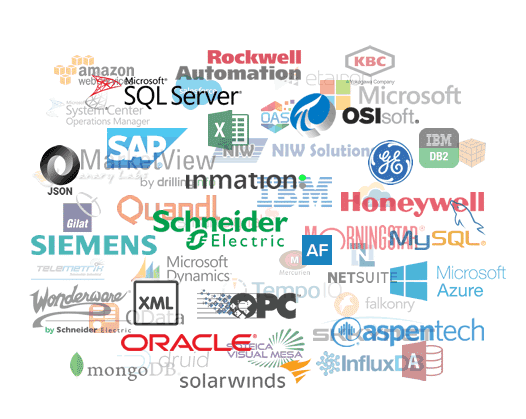
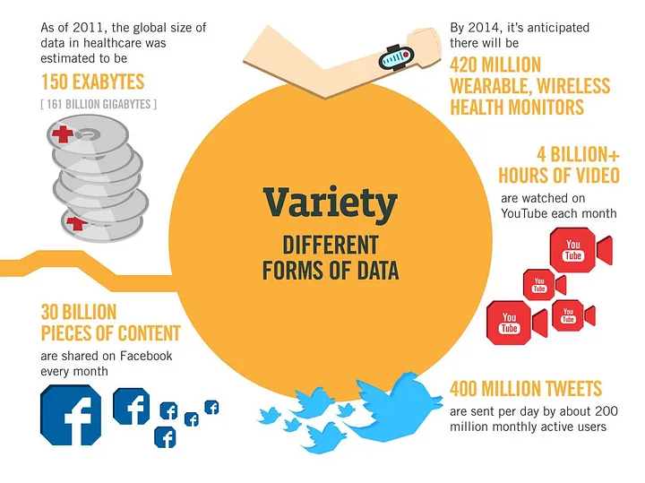
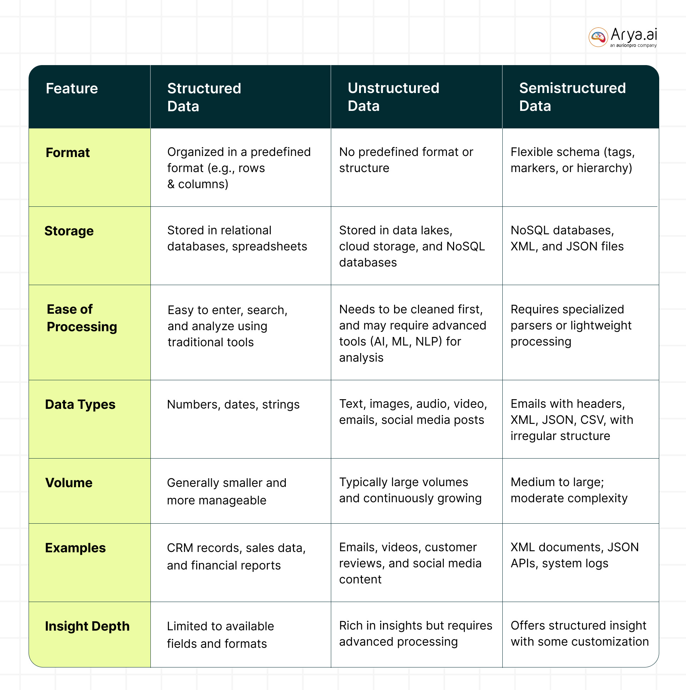
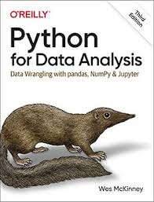
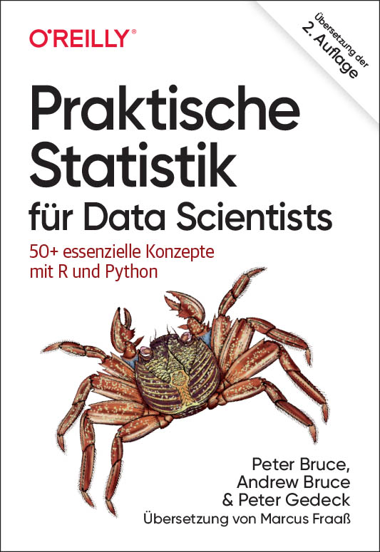

# Clase 02: Trabajando con datos

> **Subtítulo**: Una introducción al workflow de datos.

## Objetivos

- Identiificar posibles fuentes de datos y herramientas para recopilarlos.
- Realizar una exploración inicial de los datos para entender su estructura y calidad y determinar qué técnicas de limpieza y transformación son necesarias.
- Aplicar técnicas de limpieza y transformación para preparar los datos para su análisis.

## Sección 1: Recopilación de datos

Para entender la recopilación de datos es importante entender que los datos pueden provenir de diversas fuenteas y presentarse en diferentes formatos.

### Variedad en las fuentes de datos

Tradicionalmente muchas soluciones de Bussiness Intelligence solamente han requerido una única fuente de datos. Sin embargo, en la actualidad es común encontrar soluciones que requieren múltiples fuentes de datos.

Los datos pueden provenir de diversas fuentes, como archivos locales, bases de datos, APIs, etc. Existen heramientas que permiten recopilar datos de estas fuentes, como **Python, R, SQL** y herramientas de BI como **Tableau, Power BI, Looker**.

Imagen Tomada de [Transpara](https://www.transpara.com/data-sources/)

La variedad en las fuentes de datos supone un reto a la hora de realizar análisis de los datos, ya que cada fuente puede tener su propia estructura y formato, su propia forma de recolección, y su propio nivel de calidad.

Durante el proceso de recopilación de datos es importante entender su fuente y contexto. Entender el contexto de los datos brinda información valiosa para medir la calidad, e identificar posibles problemas o limitaciones, seleccionar las técnicas de limpieza y transformación más apropiadas.

### Modos de recepción de datos

Además de la diversidad en las fuentes, la frecuencia y el momento en que se reciben los datos definen dos modalidades principales:

- **Procesamiento por lotes (Batch):** Los datos se recolectan, almacenan y procesan en grupos o "lotes" en intervalos de tiempo específicos (diario, semanal, mensual). Es ideal para grandes volúmenes de datos históricos donde no se requiere una respuesta inmediata.
- **Procesamiento en tiempo real (Streaming):** Los datos se procesan de forma continua a medida que se generan. Es fundamental para aplicaciones que requieren respuestas instantáneas, como la detección de fraudes financieros, monitoreo de sensores IoT o análisis de redes sociales en vivo.

### Variedad en el formato de los datos

La variedad en el formato de los datos es otro aspecto importante a considerar. Los datos pueden presentarse en una amplia gama de formatos dependiendo de su contenido:

- **Texto y Tabulares:** `.csv`, `.tsv`, `.txt`.
- **Documentos:** `.pdf`, `.docx`, `.odt`.
- **Imágenes:** `.jpg`, `.png`, `.tiff`, `.svg`.
- **Audio y Video:** `.mp3`, `.wav`, `.mp4`, `.avi`.
- **Datos de sensores:** `.json`, `.xml`, `.csv`.
- **Datos de redes sociales:** `.json`, `.csv`.
- **Datos de bases de datos:** `.sql`, `.csv`, `.json`.

Para su procesamiento y análisis, es fundamental clasificar los datos según su nivel de estructura:

1. **Datos Estructurados:** Tienen un formato predefinido y rígido, generalmente organizados en tablas con filas y columnas. Son fáciles de buscar y analizar mediante lenguajes como SQL.
    **Ejemplos:** Bases de datos relacionales (MySQL, PostgreSQL), hojas de cálculo de Excel.
2. **Datos Semi-estructurados:** No residen en una base de datos relacional, pero poseen una estructura interna (metadatos o etiquetas) que facilita su jerarquización.
    **Ejemplos:** Archivos `JSON`, `XML`, `YAML`, logs de servidores.
3. **Datos No Estructurados:** Carecen de una estructura o formato específico, lo que los hace más complejos de analizar de forma automatizada. Representan la mayor parte de los datos generados hoy en día.
    **Ejemplos:** Correos electrónicos, archivos de audio, imágenes, videos, publicaciones en redes sociales.

---

## Sección 2: EDA (Exploratory Data Analysis)

El **Análisis Exploratorio de Datos (EDA)** es el proceso inicial de investigación sobre un conjunto de datos para descubrir patrones, detectar anomalías, probar hipótesis y verificar suposiciones mediante estadísticas resumidas y representaciones gráficas.

### ¿Por qué realizar un EDA?

El objetivo principal es comprender la naturaleza de los datos antes de aplicar modelos complejos o extraer conclusiones. Realizar un EDA permite:

- **Validar la calidad de los datos:** Identificar valores nulos, duplicados o tipos de datos incorrectos.
- **Detectar Outliers:** Encontrar valores atípicos que puedan sesgar el análisis o indicar errores de medición.
- **Entender distribuciones:** Conocer cómo se reparten los valores de cada variable (normalidad, sesgo, etc.).
- **Identificar correlaciones:** Descubrir relaciones y dependencias entre diferentes variables del dataset.

### Herramientas para realizar un EDA

En el ecosistema de **Python**, las herramientas más potentes y utilizadas son:

1. **Pandas:** La librería estándar para la manipulación y análisis de datos tabulares (DataFrames).
2. **Matplotlib y Seaborn:** Librerías de visualización para crear gráficos estadísticos como histogramas, diagramas de dispersión y mapas de calor.
3. **ydata-profiling (anteriormente pandas-profiling):** Una herramienta de automatización que genera informes detallados en HTML con estadísticas descriptivas, alertas de calidad y correlaciones con muy pocas líneas de código.

---

## Sección 3: Limpieza de datos

La limpieza de datos es el proceso de eliminación de datos erróneos, incompletos o duplicados, y la corrección de datos incorrectos o inconsistentes.

### ¿Por qué realizar la limpieza de datos?

La limpieza de datos es esencial para garantizar la calidad y la precisión de los análisis y conclusiones que se extraen de los datos. Al eliminar datos erróneos o incompletos, se reduce el riesgo de sesgos y errores en los resultados. Además, la limpieza de datos ayuda a identificar y corregir errores de medición, lo que mejora la confiabilidad de los análisis y las conclusiones.

### Herramientas para realizar la limpieza de datos

En el ecosistema de **Python**, las herramientas más potentes y utilizadas son:

1. **Pandas, Polars y Dask:** Las librerías estándar para la manipulación y análisis de datos tabulares (DataFrames).
2. **Matplotlib y Seaborn, y ydata-profiling (anteriormente pandas-profiling):** Se pueden utilizar para la visualización de los datos limpios.

---

## Sección 4: Transformación de datos

La transformación de datos es el proceso de convertir datos de un formato a otro, generalmente para hacerlos más útiles o para prepararlos para su análisis.

### ¿Por qué realizar la transformación de datos?

La transformación de datos es esencial para garantizar la calidad y la precisión de los análisis y conclusiones que se extraen de los datos. Al eliminar datos erróneos o incompletos, se reduce el riesgo de sesgos y errores en los resultados. Además, la transformación de datos ayuda a identificar y corregir errores de medición, lo que mejora la confiabilidad de los análisis y las conclusiones.

### Herramientas para realizar la transformación de datos

En el ecosistema de **Python**, las herramientas más potentes y utilizadas son:

1. **Pandas, Polars y Dask:** La librerías estándar para la manipulación y análisis de datos tabulares (DataFrames).
2. **Matplotlib y Seaborn, y ydata-profiling (anteriormente pandas-profiling):** Se pueden utilizar para la visualización de los datos transformados.

---

## Libros recomendados

1. Wes McKinney. **Python for Data Analysis**. O'Reilly. 3rd Edition.

2. Bruce, P., Bruce, A., & Gedeck, P. (2020). **Practical Statistics for Data Scientists: 50+ Essential Concepts Using R and Python**. O’Reilly Media. 2nd Edition.

### Algunas páginas donde se pueden encontrar datasets

- **Awesome Public Datasets** link: <https://github.com/awesomedata/awesome-public-datasets>
- **Kaggle Datasets** link: <https://www.kaggle.com/datasets>
- **Reisanar Datasets** link <https://github.com/reisanar/datasets>
- **rfordatascience/tidytuesday** link: <https://github.com/rfordatascience/tidytuesday>
- **UCI Machine Learning Repository** link: <https://archive.ics.uci.edu/ml/datasets.php>
- **Google Dataset Search** link: <https://datasetsearch.research.google.com/>
- **Data.gov** link: <https://www.data.gov/>
- **World Bank Open Data** link: <https://data.worldbank.org/>
- **Google Dataset Search** link: <https://datasetsearch.research.google.com/>

