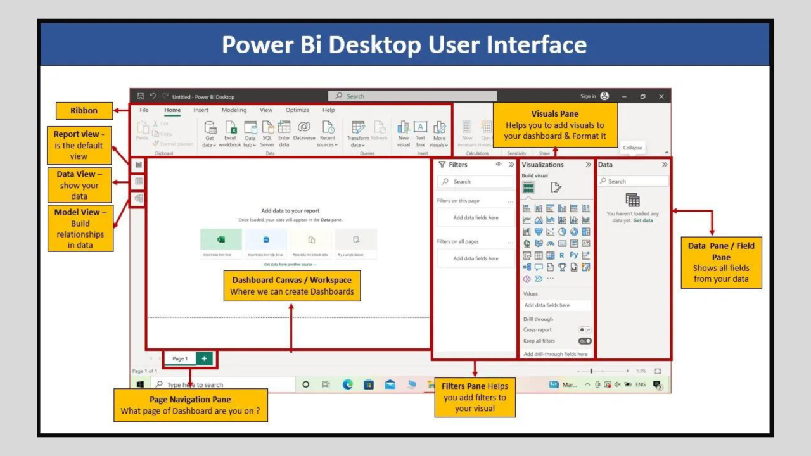
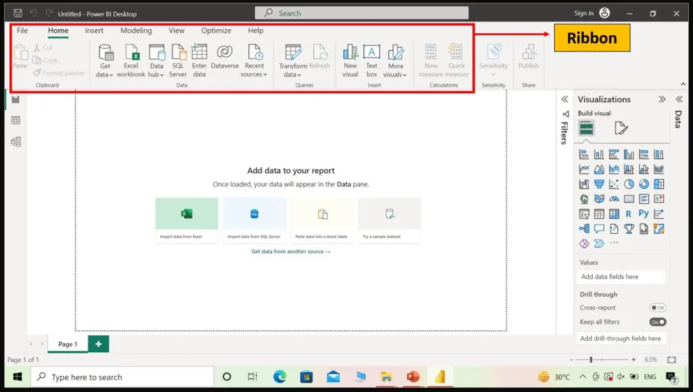
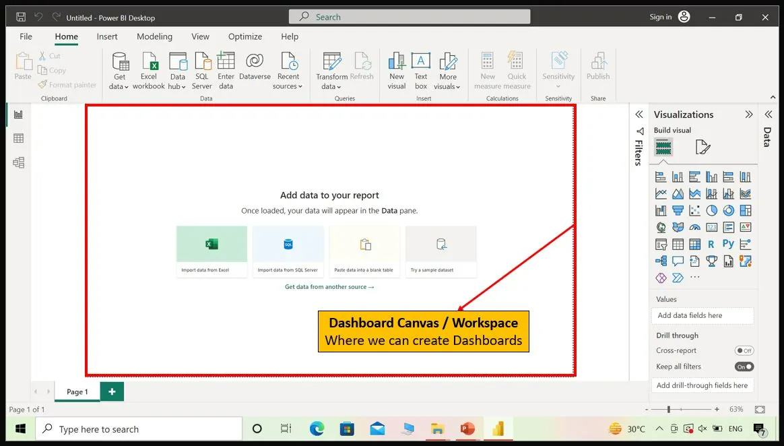
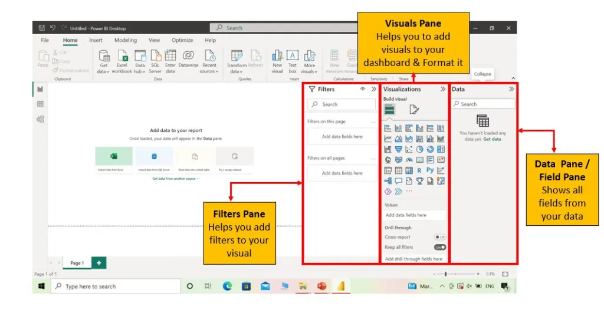

# Clase 03: Power BI - Visualización de Datos

## Introducción

### Explora la interfaz de Power BI Desktop

Cuando abres Power BI Desktop, verás una interfaz intuitiva diseñada para ayudarte a crear informes de manera eficiente:

* **Barra de título**: Muestra el nombre del informe actual y la versión de Power BI Desktop. También incluye los botones estándar de minimizar, maximizar y cerrar.

* **Cinta de opciones (Ribbon)**: Contiene pestañas como Inicio, Insertar y Modelado con herramientas para trabajar con datos y visualizaciones.

  * **Inicio**: Incluye opciones para guardar, abrir y cerrar informes, así como deshacer y rehacer acciones. También permite administrar orígenes de datos, actualizar datos y aplicar transformaciones mediante el Editor de Power Query.

  * **Insertar**: Permite agregar nuevos elementos al lienzo del informe. Desde esta pestaña puedes insertar diferentes visualizaciones como gráficos, tablas, matrices, tarjetas, imágenes y formas. También puedes agregar cuadros de texto, botones y otros elementos interactivos para mejorar la funcionalidad del informe.

  * **Modelado**: Incluye herramientas para administrar relaciones entre tablas, definir columnas calculadas y medidas, y crear jerarquías. También permite ordenar y filtrar datos, crear tablas calculadas y administrar perspectivas.

  * **Vista**: Permite personalizar la visualización y el diseño del lienzo del informe. Ofrece opciones para acercar o alejar (zoom), ajustar el informe a la ventana actual y mostrar u ocultar elementos como líneas de cuadrícula, encabezados visuales y fondos. También permite cambiar entre diferentes vistas: Vista de informe, Vista de datos y Vista de modelo.

  * **Optimizar**: Permite mejorar el rendimiento y analizar el comportamiento del informe. Incluye opciones como Pausar elementos visuales, Actualizar elementos visuales, Analizador de rendimiento y Aplicar todos los segmentadores.

  * **Ayuda**: Proporciona acceso a recursos y asistencia relacionados con Power BI, incluyendo documentación, foros de la comunidad, soporte y materiales de aprendizaje.

* **Lienzo del informe**: Es el área principal donde se crean y organizan las visualizaciones. Puedes arrastrar y soltar gráficos en el lienzo, cambiar su tamaño y reorganizarlos para diseñar el informe.

* **Panel de datos (Campos)**: Se encuentra en el lado derecho de la Vista de informe. Muestra los campos (columnas) del conjunto de datos. Desde aquí puedes arrastrar campos hacia las visualizaciones, crear relaciones entre tablas y definir medidas o columnas calculadas. En versiones anteriores se conocía como Panel de campos.

* **Panel de visualizaciones**: También ubicado en el lado derecho. Permite seleccionar y personalizar los tipos de gráficos. Muestra una lista de visualizaciones disponibles, como gráficos de barras, líneas, mapas, tablas y más. Puedes arrastrar campos a las áreas correspondientes del visual seleccionado para configurarlo.

* **Panel de filtros**: Ubicado en el lado derecho de la pantalla. Permite aplicar filtros a nivel de visual, página o informe completo. Desde aquí puedes configurar filtros para controlar qué datos se muestran en cada visualización o en todo el reporte.

* **Panel de vistas**: Ubicado en el lado izquierdo de la pantalla. Permite cambiar entre tres vistas principales:

  * **Vista de informe**: Es la vista predeterminada. Aquí se diseñan y construyen los informes agregando y organizando visualizaciones en el lienzo.

  * **Vista de datos**: Permite explorar los datos en formato tabular (filas y columnas). Es útil para revisar la calidad de los datos, identificar problemas y verificar que estén correctamente formateados.

  * **Vista de modelo**: Permite crear y administrar las relaciones entre tablas. Muestra una representación visual del modelo de datos, facilitando la definición de relaciones, columnas calculadas y medidas.

Tómate un momento para explorar el diseño de la interfaz; está pensada para ser intuitiva y flexible.

---

### Conectar a datos

Power BI puede conectarse a una amplia variedad de fuentes de datos, incluyendo archivos de Excel, bases de datos, servicios en la nube y más.

Para conectarte a una fuente de datos:

1. Haz clic en el botón **Obtener datos** en la pestaña **Inicio**.
2. Selecciona el tipo de origen de datos de la lista.
3. Sigue los pasos indicados para completar la conexión.

Una vez conectado, puedes explorar y transformar los datos en el **Editor de Power Query** antes de cargarlos en el informe.

---

### Crea tu primera visualización

---

## Referencias

* [Power BI Desktop](https://powerbi.microsoft.com/es-es/desktop/)
* [Microsoft Power BI User Interface](https://www.linkedin.com/pulse/microsoft-power-bi-user-interface-belayet-hossain-belayet-hossain--knnrc/)
